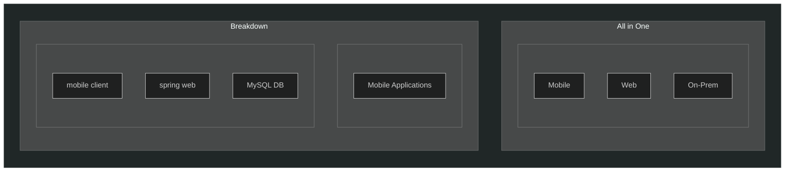

# spring5webapp

```mermaid
%%{init: {'theme': 'dark'}}%%

flowchart TB
mobile["Mobile"]
web["Web"]
on-prem["On-Prem"]

subgraph background ["&nbsp;"]
  style background fill:#202727,strok-width:0
  direction TB
  
  %%t1["Overall"] --- overall
  subgraph overall ["All in One"]
    direction TB
    subgraph oabox ["&nbsp;"]
      direction TB
      mobile & web & on-prem
    end
  end
  
  subgraph breakbox ["Breakdown"]
    direction TB
    subgraph box0 ["&nbsp;"]
      direction TB
      mba["Mobile Applications"]
    end
    subgraph box1 ["&nbsp;"]
      direction TB
      mba1["mobile client"]
      web1["spring web"]
      db1["MySQL DB"]
    end
  end
end
  
```

